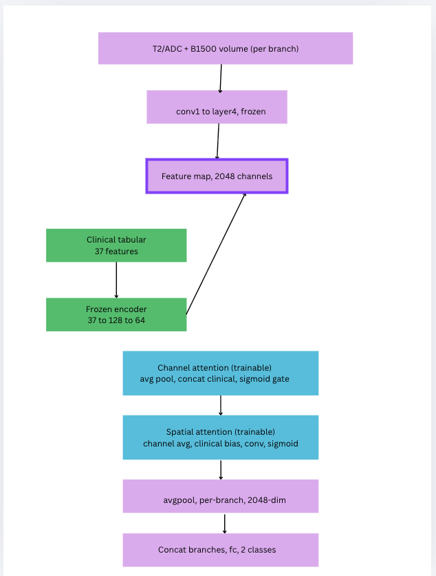

## (CBAM) — Convolutional Block Attention with Frozen Clinical Encoder

### Overview
This model applies clinical-guided attention after the full ResNet backbone has run, unlike early-scalar, which is mid-run. 
It uses two sequential, complementary attention mechanisms, both conditioned on the same frozen clinical embedding.

### Architecture

**Per branch:**
1. Full frozen ResNet backbone (`conv1 → layer4`) processes the volume into a 2048-channel feature map
2. **Channel attention** : asks "which of the 2048 feature channels matter most for this patient?" It pools the feature map spatially, concatenates the frozen clinical embedding, and learns a sigmoid gate per channel, scaling each channel up or down based on clinical context
3. **Spatial attention** : asks "which spatial regions of the scan matter most?" It averages across channels to get a single spatial heatmap, adds a clinical-derived bias to it, refines it with a small convolution, and applies a sigmoid gate , scaling different locations up or down
4. Both attention steps multiply directly into the feature map, applied sequentially (channel first, then spatial)
5. `avgpool` collapses the modulated feature map to a 2048-dim vector

**Fusion head:**
- Concatenate both branches → `fc: 4096 → 256 → 2`

### Whats trainable vs frozen
- **Frozen**: ResNet backbone (double-frozen, same as other architectures), clinical encoder
- **Trainable**: `channel_attn` MLP, `spatial_attn` MLP+conv, final `fc` classifier

### Key difference from the other two architectures
- **Late fusion**: clinical and imaging never interact until the very end (simple concat)
- **Early scalar**: clinical reshapes imaging *once*, early in the network (after layer1), then the rest of the ResNet processes the modulated features
- **CBAM**: clinical reshapes imaging *twice*, at the very end (after layer4), first deciding which feature *channels* matter, then which spatial *locations* matter. This is the most clinically-expressive of the three, since it gets two independent chances to inject clinical context, but also has the most trainable parameters and the deepest imaging features to condition on.

### Diagram description

Both paths run in parallel  essentially, with imaging down the middle, clinical on the left,  and they meet at "Feature map, 2048 channels", where the diagonal arrow shows the frozen clinical embedding joining the feature map before attention begins.

From there, both the feature map and the clinical embedding flow together into channel attention, then spatial attention:

- Channel attention: pools the 2048-channel feature map down to one number per channel, concatenates that with the 64-dim clinical embedding, and learns a sigmoid gate — deciding which of the 2048 channels to amplify or suppress for this patient
- Spatial attention: averages across all channels to get one spatial heatmap, adds a clinical-derived bias to shift that heatmap based on the patient's profile, refines it with a small convolution, and applies a sigmoid gate — deciding which regions of the scan to amplify or suppress

Both gates multiply directly back into the original 2048-channel feature map (not shown as a separate arrow, but implied , the attention modules take x in and return a reweighted x out). After both attention steps, avgpool collapses everything to a 2048-dim vector per branch, and the two branches (T2, ADC+B1500) get concatenated and classified.

Block by block description:

**T2/ADC + B1500 volume (per branch)** : the raw MRI input for each imaging branch, processed independently.

**conv1 to layer4, frozen** : the entire pretrained ResNet3D backbone, running with fixed weights end-to-end for this branch.

**Feature map, 2048 channels** : the output of the frozen backbone, a 3D imaging representation with 2048 channels, ready to be modulated by clinical context.

**Clinical tabular (37 features)** : raw structured clinical variables (PSA, PIRADS, zone, etc.) for this patient.

**Frozen encoder (37 to 128 to 64)** : the pretrained clinical MLP, permanently frozen and dropout-disabled, producing a deterministic 64-dim clinical embedding.

**(diagonal arrow)** : the clinical embedding joins the imaging feature map at this point, feeding into both attention modules below.

**Channel attention (trainable)** : pools the feature map spatially, concatenates it with the clinical embedding, and learns a sigmoid gate that decides which of the 2048 channels to amplify or suppress for this patient.

**Spatial attention (trainable)** : averages the feature map across channels into a single spatial heatmap, adds a clinical-derived bias, refines it with a small convolution, and learns a sigmoid gate that decides which spatial regions to amplify or suppress.

**avgpool, per-branch, 2048-dim** : after both attention steps reweight the feature map, global average pooling collapses it into a single 2048-dim vector per branch.

**Concat branches, fc, 2 classes** : the two branches' 2048-dim vectors are concatenated, passed through a small classifier, and output as csPCa vs not.