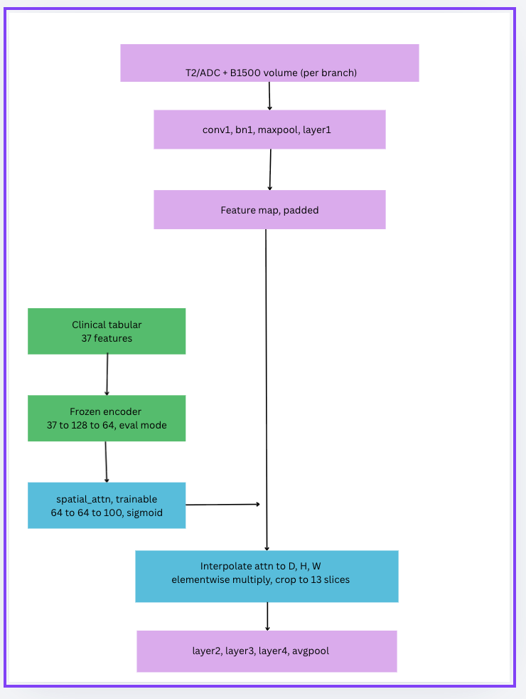

## Overview

This is different from late fusion, since this model injects clinical information mid-network, and the clinical signal directly modulates spatial regions of the imaging feature map after the first ResNet block, before the remaining convolutional layers process it further.

## Architecture

Per branch (T2, and stacked ADC+B1500):

conv1 → bn1 → maxpool → layer1 —> first stage of the frozen ResNet

Clinical injection point: the frozen 64-dim clinical embedding is passed through a small trainable MLP (spatial_attn: 64→64→100) that generates a per-location attention scalar

This attention map is resized via interpolate to match the feature map's spatial dimensions (D, H, W), then applied as an elementwise multiplier,  effectively telling the network "pay more/less attention to these spatial regions, based on this patient's clinical profile"

The modulated features continue through layer2 → layer3 → layer4 → avgpool

## Fusion head:

Concatenate both branches' 2048-dim outputs → fc: 4096 → 256 → 2

### What's trainable vs frozen
Frozen: ResNet conv/bn layers (both requires_grad=False and locked in eval() mode), clinical encoder (same double-freeze as late fusion)

Trainable: spatial_attn MLP (learns how to translate clinical embeddings into spatial attention), final fc classifier

### Key difference from late fusion

Late fusion combines modalities only at the very end: imaging and clinical never interact until the final concat. 
Early scalar attention lets clinical information shape which spatial regions of the MRI the network emphasizes, before deeper feature extraction happens. 
This tests whether clinical context (e.g., known lesion location, PIRADS score) can guide the imaging pathway to focus on more diagnostically relevant regions.

### Diagram description
T2/ADC+B1500 volume (per branch) —> the raw MRI input for each imaging branch, processed independently.

conv1, bn1, maxpool, layer1 —> the first stage of the frozen ResNet3D backbone; extracts early spatial features before any clinical information is introduced.

Feature map, padded —> the output of layer1, padded so its depth dimension aligns with the attention map that will modulate it.

Clinical tabular (37 features) —> raw structured clinical variables (PSA, PIRADS, zone, etc.) for this patient.

Frozen encoder (37→128→64, eval mode) —> the same pretrained clinical MLP used in late fusion, permanently frozen and dropout-disabled so its output is deterministic, essentially making the encoder give the exact same output every time for the same patient, with no random noise mixed in.

spatial_attn (trainable, 64→64→100, sigmoid) —> the only new trainable component here. Takes the frozen clinical embedding and learns to produce a 100-dim attention signal, later reshaped into a spatial mask, which is essentially a 3D grid of attention weights from 0-1 that dims or boosts different regions of the MRI feature map based on the patient's clinical profile.

Interpolate attn to D,H,W → elementwise multiply → crop to 13 slices:  the attention mask is resized to match the feature map's spatial dimensions, then multiplied elementwise into the imaging features,  so clinical context reweights which spatial regions of the MRI the network pays attention to, before deeper layers process it further.

layer2, layer3, layer4, avgpool —> the rest of the frozen ResNet processes the now-clinically-modulated feature map into the final 2048-dim branch output.

The key idea versus late fusion: clinical info here doesn't just get concatenated at the end — it actively reshapes the imaging pathway itself, mid-network.

