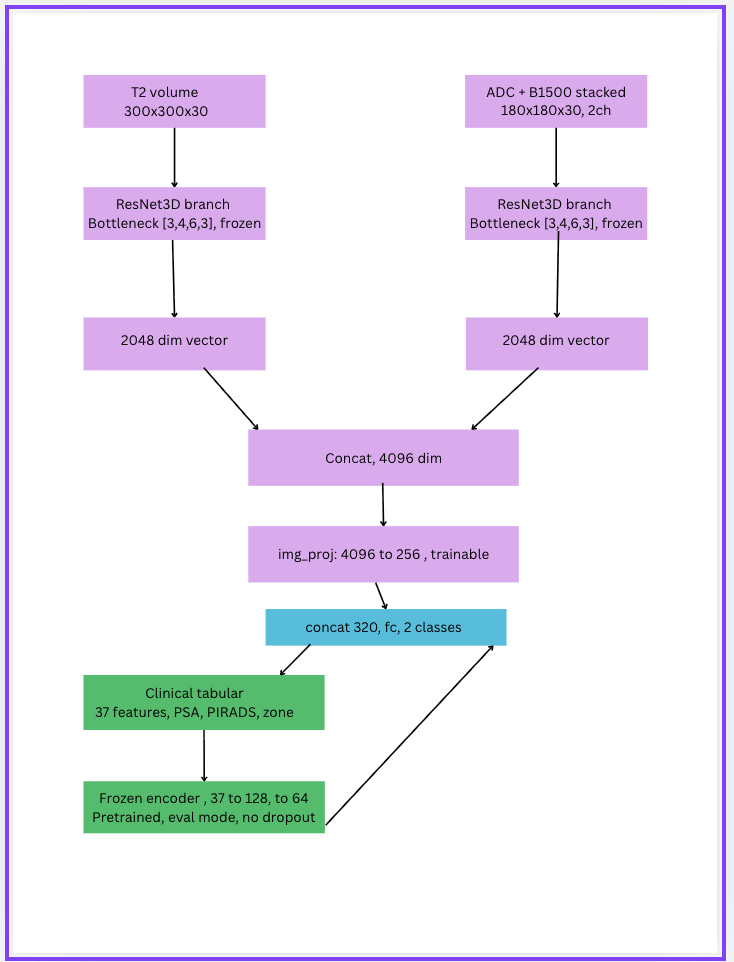

## `LateFusionFlatFrozen` — Late Fusion with Frozen Clinical Encoder

### Overview
This model fuses 3D MRI imaging features (T2, ADC, B1500) with clinical tabular features at a **late fusion** stage. Here,  each modality is independently encoded, then concatenated just before the final classifier.

This architecture fuses two independently pertained modalities for prostate cancer classifications , with a frozen dual branch 3D ResNet processes T2 and stacked ADC/B1500 MRI volumes into a 4096-dim imaging representation, and a frozen clinical MLP encodes a 37 structured clinical features (PSA, PIRADS, zone, etc) into a 64 dim embedding.
Out of everything, only two small components are trainable:
1. A projection layer that compresses the imaging features to 256 dimensions 
2. Final classifier that combines both modalities to predict clinically significant prostate cancer

### Architecture

**Imaging branch:**
- 3 ResNet3D branches (Bottleneck blocks, [3,4,6,3] layers) — one per series (T2, and stacked ADC+B1500)
- Each branch outputs a 2048-dim feature vector
- Concatenated → projected down to 256-dim via img_proj
- **Fully frozen** —> pretrained weights, never updated during fusion training

**Clinical branch:**
- `FrozenClinicalEncoder`: flat 2-layer MLP, `37 → 128 → 64`
- Loads pretrained weights from a standalone clinical MLP (trained separately, achieving ~0.87 val AUC on its own)
- **Fully frozen** — both requires_grad=False on all parameters, and permanently locked in `eval()` mode

**Fusion head:**
- Concatenate `img_emb` (256) + `clin_emb` (64) → 320-dim
- `fc`: `320 → 128 → 2` (this is the only trainable part of the model)

## Explanation of diagram

T2 volume / ADC+B1500 stacked: 
Two separate MRI input types, each with its own crop size and channel count

ResNet3D branch (frozen): 
Pretrained 3D ResNet per modality, weights fixed,  and it extracts imaging features without further training

2048-dim vector: 
The pooled output of each frozen ResNet branch

Concat, 4096-dim:
The two imaging vectors stacked together

img_proj (trainable):
A small linear+ReLU layer that compresses 4096→256, and this is the only part of the imaging path that learns

Clinical tabular (37 features): 
Raw PSA, PIRADS, zone, and other structured clinical variables

Frozen encoder (37→128→64): 
Pretrained clinical MLP, weights fixed and dropout disabled so its 64-dim output is always deterministic

concat 320, fc, 2 classes:
Combines the 256-dim image embedding with the 64-dim clinical embedding, then the trainable classifier head predicts csPCa vs not